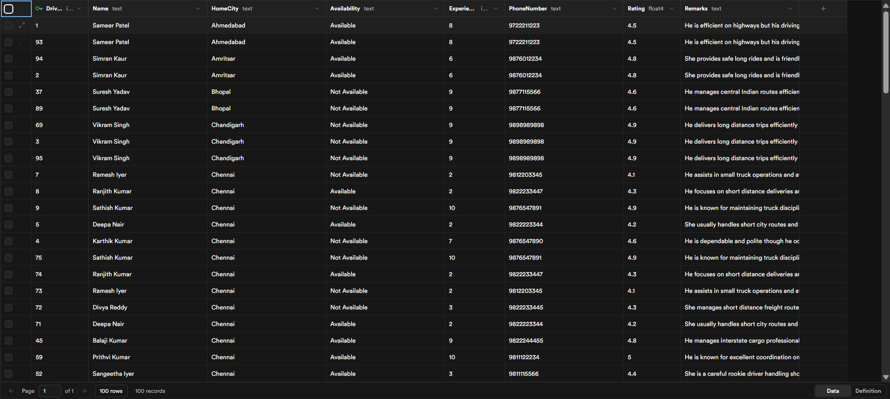
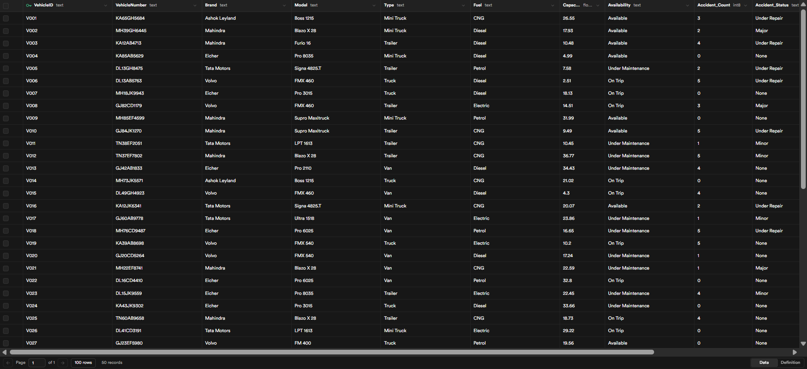

# 🚗 UiPath Agent Project — Vehicle & Driver Availability Workflow

This repository contains my **first UiPath Agent Development Project**, designed to automate and optimize the process of matching **available drivers and vehicles** for logistics planning based on **route data, weather, and traffic conditions**.

---

## 🧠 Project Overview

The **Vehicle & Driver Availability Workflow** is an AI-integrated automation built using **UiPath Integration Service**.  
It combines **RPA precision** with **AI-driven decision-making** to analyze transportation routes and recommend the best possible plan for logistics dispatch.

### 💡 Key Features
- ✅ Intelligent vehicle & driver matching  
- 🌦️ Weather and traffic analysis for route risk assessment  
- 📊 Smart recommendations with plan and precautions  
- 🧩 Modular workflows for scalability  
- 🔄 AI evaluation pipeline for output scoring  

---

## ⚙️ System Components

| Component | Description |
|------------|--------------|
| **Driver Availability Workflow** | Filters and ranks available drivers based on experience, proximity, and workload. |
| **Vehicle Availability Workflow** | Selects the most suitable vehicles based on type, fuel, capacity, and availability. |
| **Main Agent Workflows** | Central logic that combines route, weather, and resource data to recommend optimal dispatch plans. |
| **Database Tables** | Local database files for storing vehicle and driver details. |
| **Evaluation Sets** | JSON datasets used to test workflow accuracy and AI evaluation performance. |

---

## 🧩 Workflow Architecture

Below are the core UiPath workflows used in the project:

### 🧍 Driver Filtration Workflow


### 🚘 Vehicle Filtration Workflow


### 🤖 Main Agents
**Agent 1:**  


**Agent 2:**  


---

## 🗂️ Database Structure

### 👨‍✈️ Driver Database


**Schema Overview**
| Field | Description |
|--------|--------------|
| Driver ID | Unique identifier for each driver |
| Name | Full name |
| Experience | Years of driving experience |
| Proximity | Distance from current pickup location |
| Phone | Contact number |
| Remarks | Notes on driver. |

### 🚛 Vehicle Database


**Schema Overview**
| Field | Description |
|--------|--------------|
| Vehicle ID | Unique identifier for each vehicle |
| Vehicle Number | Registration number |
| Brand | Manufacturer |
| Model | Vehicle model |
| Type | Truck, Lorry, Van, etc. |
| Fuel | Petrol/Diesel/Electric |
| Capacity | Load capacity |
| Remarks | maintenance note |

---

## 📈 Evaluation Framework

The project uses **AI-based semantic evaluation** to score output JSONs against expected results.  
The evaluator prompt compares contextual accuracy — not exact string matches — allowing flexible and intelligent output scoring.

Example evaluation fields include:
- Route summary accuracy  
- Weather and traffic context  
- Correct mapping of driver/vehicle lists  
- Logical recommendation plans    

---

## 🧾 Example 
Input
```json
{
  "from": "Chennai",
  "to": "Delhi",
  "weight": "15 tonns"
}
```

Output
```json
{
  "content": {
    "routeSummary": {
      "origin": "Chennai",
      "destination": "Delhi",
      "distance": 2200,
      "duration": 40
    },
    "trafficAndWeather": {
      "trafficConditions": "Moderate traffic expected along NH44 with occasional bottlenecks near major cities.",
      "weatherForecast": "Clear skies expected for most of the route. Delhi may experience light fog in the early morning hours.",
      "risks": [
        "Light fog in Delhi may reduce visibility during early hours."
      ]
    },
    "availableDrivers": [
      {
        "name": "Raj Malhotra",
        "id": "17",
        "experience": "8 years",
        "hometownProximity": "Delhi",
        "phoneNumber": "9876001122",
        "remarks": "An expert driver who knows Delhi routes thoroughly but tends to be impatient during peak traffic"
      },
      {
        "name": "Anil Kumar",
        "id": "63",
        "experience": "10 years",
        "hometownProximity": "Delhi",
        "phoneNumber": "9811172200",
        "remarks": "He manages high-value cargo routes with precision and punctuality"
      }
    ],
    "availableVehicles": [
      {
        "VehicleID": "V009",
        "VehicleNumber": "MH85EF4599",
        "Brand": "Mahindra",
        "Model": "Supro Maxitruck",
        "Type": "Mini Truck",
        "Fuel": "Petrol",
        "Capacity": "31.99 tons",
        "Remark": "Minor dent on rear side"
      },
      {
        "VehicleID": "V027",
        "VehicleNumber": "GJ23EF5980",
        "Brand": "Volvo",
        "Model": "FM 400",
        "Type": "Truck",
        "Fuel": "Petrol",
        "Capacity": "19.56 tons",
        "Remark": "Recently returned from long trip"
      }
    ],
    "finalRecommendation": {
      "plan": "Assign driver Anil Kumar (10 years of experience) with vehicle Volvo FM 400 (19.56 tons capacity). The vehicle is in excellent condition and recently returned from a long trip. Start the journey early morning to avoid traffic congestion near Chennai and Delhi.",
      "precautions": [
        "Ensure the vehicle undergoes a pre-trip inspection.",
        "Plan for rest stops every 6-8 hours to avoid driver fatigue.",
        "Carry fog lights and ensure they are functional for early morning fog in Delhi.",
        "Monitor weather updates for any sudden changes."
      ]
    }
  }
}

